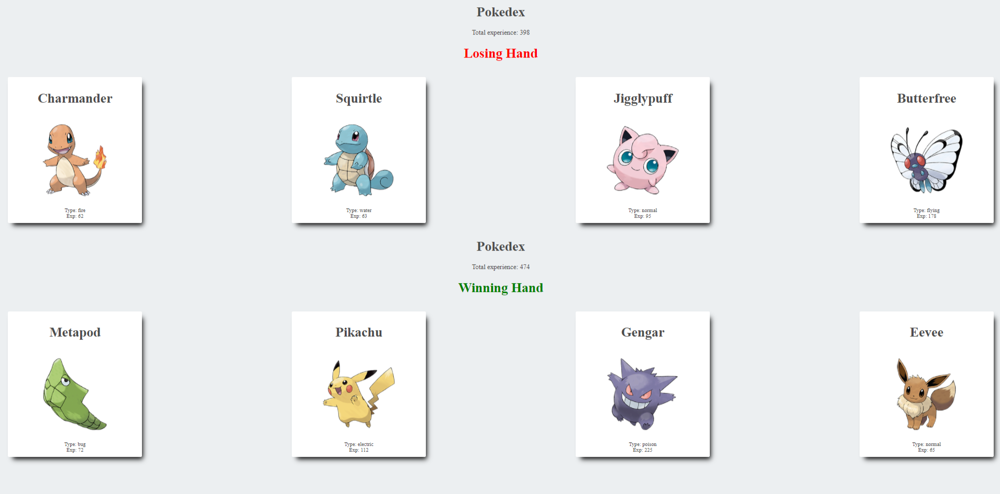

# Pokedex React game

Simple game built for learning purposes foloowing a task on Udemy course The Modern React Bootcamp (Hooks, Context, NextJS, Router) by Colt Steele. This exercise let me practice React components and properties. It is a pokemon application ("a pokedex") that looks like this: 

## Available Scripts

In the project directory, you can run:

### `npm start`

Runs the app in the development mode.\
Open [http://localhost:3000](http://localhost:3000) to view it in the browser.

The page will reload if you make edits.\
You will also see any lint errors in the console.

### `npm test`

Launches the test runner in the interactive watch mode.\
See the section about [running tests](https://facebook.github.io/create-react-app/docs/running-tests) for more information.

## Acknowlegements
- Colt Steele
